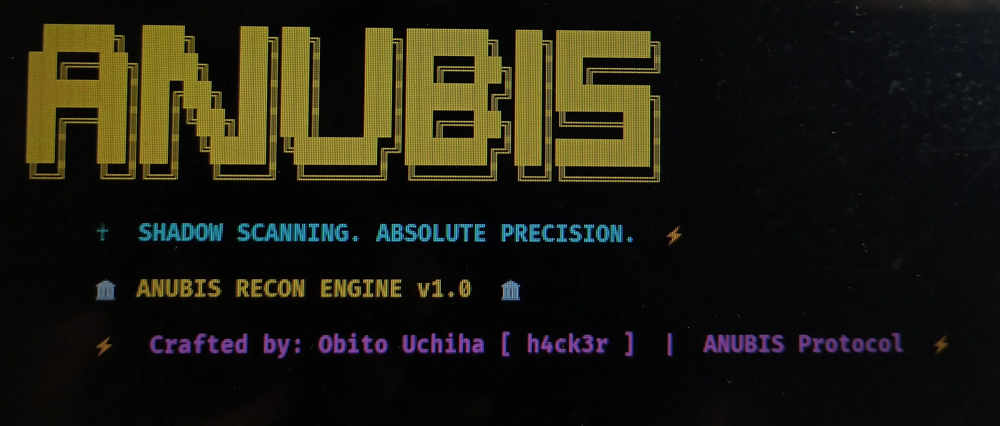

<p align="center"></p>

# ☥ ANUBIS – Shadow Scanning. Absolute Precision.

**ANUBIS** is a **29-phase reconnaissance engine** for Bug Bounty & VAPT. It automates the entire recon pipeline – from WHOIS to Nuclei – giving you a prioritized attack surface in minutes.

> 🚀 **Built for speed, precision, and stealth.**
> 🔍 **Covers 100% of the recon workflow (40 original phases compressed into 29).**

---

## ✨ Features

- 🔎 **Passive & Active Subdomain Enumeration** (Subfinder, crt.sh, brute-force, permutations)
- 🌐 **DNS Resolution + CNAME Takeover Detection**
- 🗄️ **Cloud Bucket Discovery** (S3, Azure, GCP)
- 🔐 **GitHub Code Search** (secrets, configs, internal files)
- 📧 **Email Enumeration** (theHarvester + fallback scraping)
- 📡 **Async Port Scanning** (top 1000 ports)
- 🧩 **Virtual Host Discovery** (proxy rotation support)
- 🌍 **HTTP Probing & Tech Stack Fingerprinting**
- 🧠 **Non-Intrusive CVE Recon** (based on detected tech)
- 🧬 **JavaScript Deep Dive** (endpoints, secrets, parameters)
- 📜 **Wayback & Historical URL Fetching** (waymore, gau, APIs)
- 🧹 **Live Validation & Prioritization** (filters static assets, flags high‑priority targets)
- 📊 **Report Generation** (JSON, Markdown, HTML)
- 🛡️ **Audit Trail** (SHA‑256 hashes of all output files)
- ⚡ **Optional Nuclei Scan** (active exploit detection – use with caution)

---

## 📦 Installation

```bash
git clone https://github.com/cossackrider8-glitch/ANUBIS.git
cd ANUBIS
python3 -m venv venv
source venv/bin/activate
pip install -r requirements.txt
```

### 🔧 Dependencies

All dependencies are listed in `requirements.txt` – no external Go tools required (fallback options exist for missing tools).

---

## 🚀 Usage

### Full pipeline (all 29 phases)

```bash
python anubis.py -d target.com
```

### Run a single phase (for testing/debugging)

```bash
python anubis.py -d target.com --phase 5
```

### Use proxy rotation (Phase 12)

```bash
python anubis.py -d target.com --proxy-file proxies.txt
```

### Enable Nuclei scan (Phase 29 – optional, sends payloads)

```bash
python anubis.py -d target.com --nuclei
```

---

## ⚠️ Warnings

- **Nuclei scan** sends real exploit payloads (LFI, SQLi, RCE). Only run on targets you own or have explicit permission to test.
- Running this tool against production systems without authorization is illegal and unethical.
- The tool uses public APIs and DNS resolution – it does **not** send intrusive payloads by default.

---

## 📂 Output Structure

All results are saved to `output/<target>/`:

```
output/
└── target.com/
    ├── phase_01_whois_*.json
    ├── phase_02_asn_*.json
    ├── ...
    ├── phase_25_master_dataset_*.json
    ├── phase_27_report_*.html
    ├── phase_28_audit_log_*.txt
    └── screenshots/               (if gowitness is installed)
```

---

## 🧠 How it Works (The 29 Phases)

| Phase | Name | Description |
|-------|------|-------------|
| 1 | WHOIS | Fetch domain registration details |
| 2 | ASN & Netblock | Discover ASN and IP ranges |
| 3 | Passive Subdomain Enum | Subfinder + crt.sh fallback |
| 4 | Active Brute‑Force | Wordlist‑based subdomain discovery |
| 5 | DNS Permutations | Mutate found subdomains |
| 6 | Certificate Transparency | Query crt.sh for SSL certs |
| 7 | DNS Resolution + CNAME Takeover | Resolve IPs, detect takeovers |
| 8 | Cloud Bucket Hunt | Check S3, Azure, GCP buckets |
| 9 | GitHub Code Search | Search GitHub for secrets/configs |
| 10 | Email Enumeration | theHarvester + fallback scraping |
| 11 | Async Port Scanning | Top 1000 TCP ports |
| 12 | Virtual Host Discovery | Test Host headers on IP:Port |
| 13 | HTTP Probing | Status codes, titles, server headers |
| 14 | Tech Stack Fingerprinting | Detect web servers, languages, frameworks |
| 15 | Confirmed Takeover | Live check of CNAME takeover risks |
| 16 | CVE Recon | Match tech against lightweight CVE DB |
| 17 | CORS / GraphQL / Favicon | Misconfigs, introspection, favicon hashes |
| 18 | Wayback & Historical URLs | waymore, gau, APIs |
| 19 | JavaScript Deep Dive | Endpoints, secrets, parameters from JS |
| 20 | Sourcemap Extraction | Fetch and parse `.js.map` files |
| 21 | URL Fuzzing | Directory busting (admin, api, backup, .env, etc.) |
| 22 | Parameter Discovery | Fuzz GET/POST parameters |
| 23 | Screenshots | Visual inspection (gowitness) |
| 24 | Live Validation & Prioritization | Filter, flag high‑priority targets |
| 25 | Dedup & Normalization | Merge, clean, and sort all data |
| 26 | Cyclic Enrichment Loop | Re‑run phases 18–24 until convergence |
| 27 | Report Generation | JSON, Markdown, HTML reports |
| 28 | Audit & Logging Trail | SHA‑256 integrity hashes |
| 29 | Nuclei Scan | Optional active exploit scanning |

---

## 🤝 Contributing

Pull requests and issues are welcome. Please ensure your code follows the existing style and passes basic tests.

---

## 📄 License

MIT License – see [LICENSE](LICENSE) for details.

---

## ⚡ Crafted by

**Obito Uchiha [ h4ck3r ]**
Bug Hunter | Red Teamer | Open‑Source Enthusiast

> *"Shadow scanning. Absolute precision."*
